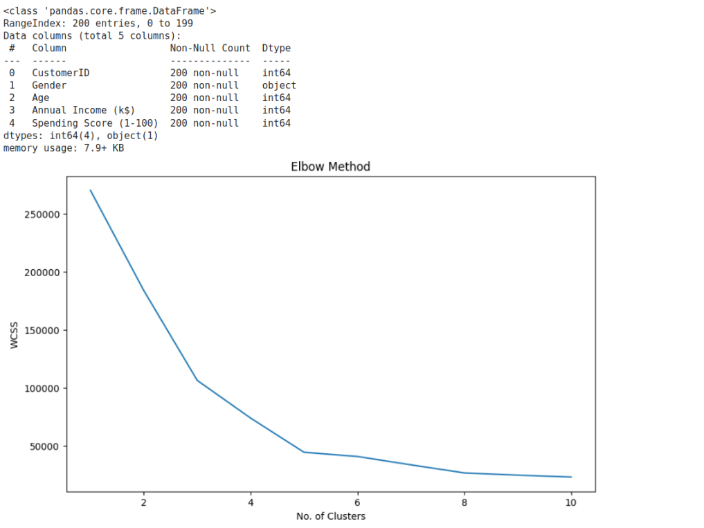
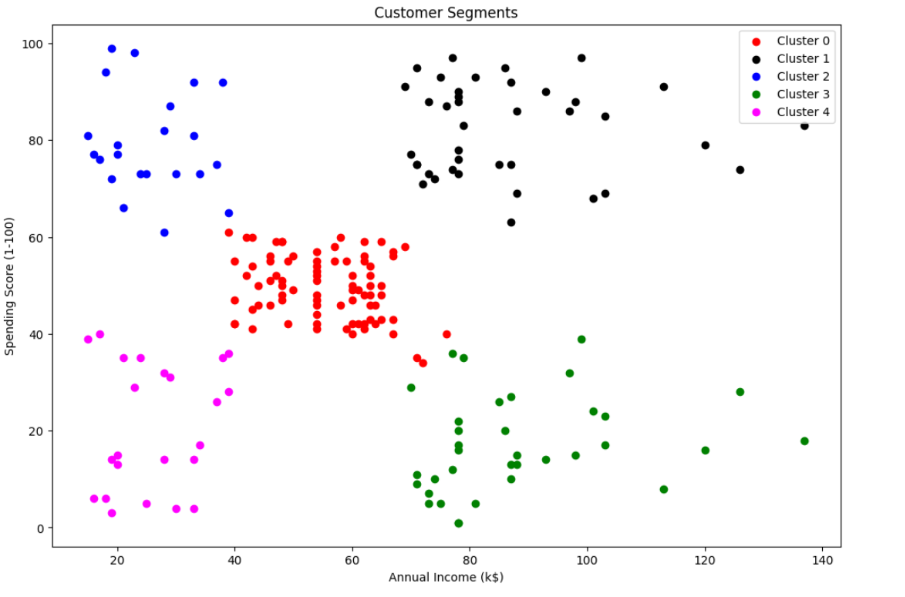

# Implementation-of-K-Means-Clustering-for-Customer-Segmentation

## AIM:
To write a program to implement the K Means Clustering for Customer Segmentation.

## Equipments Required:
1. Hardware – PCs
2. Anaconda – Python 3.7 Installation / Jupyter notebook

## Algorithm
1. 
2. 
3. 
4. 

## Program:
```
/*
Program to implement the K Means Clustering for Customer Segmentation.
Developed by: vijay k
RegisterNumber: 24901153 
*/
```
import pandas as pd
import matplotlib.pyplot as plt
from sklearn.cluster import KMeans

# Read the data
data = pd.read_csv("/content/Mall_Customers.csv")
data.head()
data.info()
data.isnull().sum()

# Calculate WCSS for different numbers of clusters
wcss = []  # Within-Cluster Sum of Square
# It is the sum of squared distance between each point & the centroid in a cluster
for i in range(1, 11):
    kmeans = KMeans(n_clusters=i, init="k-means++", random_state=42)
    kmeans.fit(data.iloc[:, 3:])
    wcss.append(kmeans.inertia_)

# Plot elbow curve
plt.figure(figsize=(10, 6))
plt.plot(range(1, 11), wcss)
plt.xlabel("No. of Clusters")
plt.ylabel("WCSS")
plt.title("Elbow Method")
plt.show()

# Perform final clustering
km = KMeans(n_clusters=5, random_state=42)
km.fit(data.iloc[:, 3:])
y_pred = km.predict(data.iloc[:, 3:])

# Add cluster labels to the dataframe
data["cluster"] = y_pred

# Create separate dataframes for each cluster
df0 = data[data["cluster"] == 0]
df1 = data[data["cluster"] == 1]
df2 = data[data["cluster"] == 2]
df3 = data[data["cluster"] == 3]
df4 = data[data["cluster"] == 4]

# Plot the clusters
plt.figure(figsize=(12, 8))
plt.scatter(df0["Annual Income (k$)"], df0["Spending Score (1-100)"], c="red", label="Cluster 0")
plt.scatter(df1["Annual Income (k$)"], df1["Spending Score (1-100)"], c="black", label="Cluster 1")
plt.scatter(df2["Annual Income (k$)"], df2["Spending Score (1-100)"], c="blue", label="Cluster 2")
plt.scatter(df3["Annual Income (k$)"], df3["Spending Score (1-100)"], c="green", label="Cluster 3")
plt.scatter(df4["Annual Income (k$)"], df4["Spending Score (1-100)"], c="magenta", label="Cluster 4")
plt.xlabel("Annual Income (k$)")
plt.ylabel("Spending Score (1-100)")
plt.legend()
plt.title("Customer Segments")
plt.show()
## Output:



## Result:
Thus the program to implement the K Means Clustering for Customer Segmentation is written and verified using python programming.
